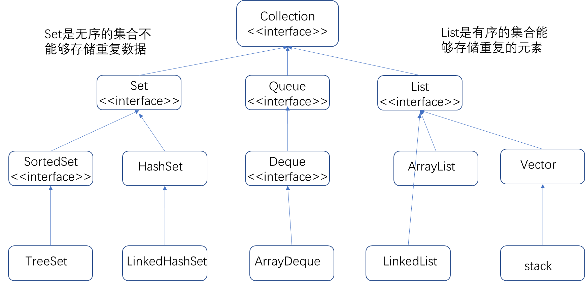
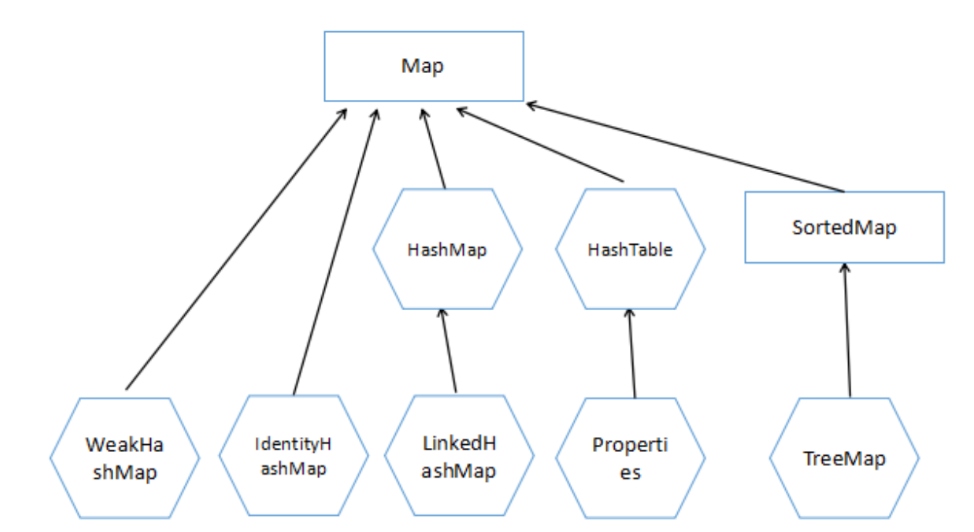
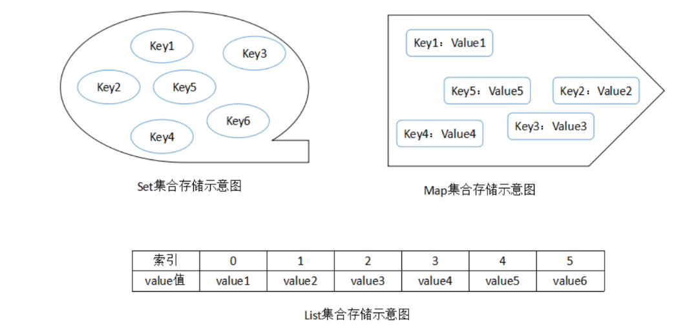
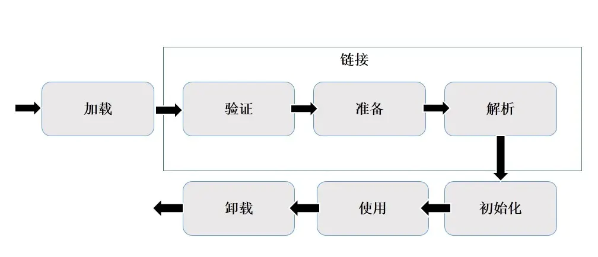
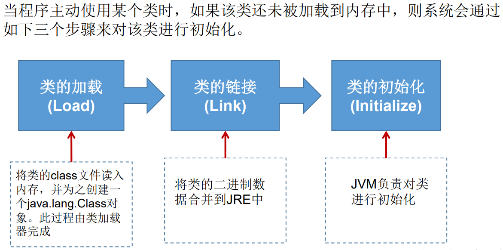
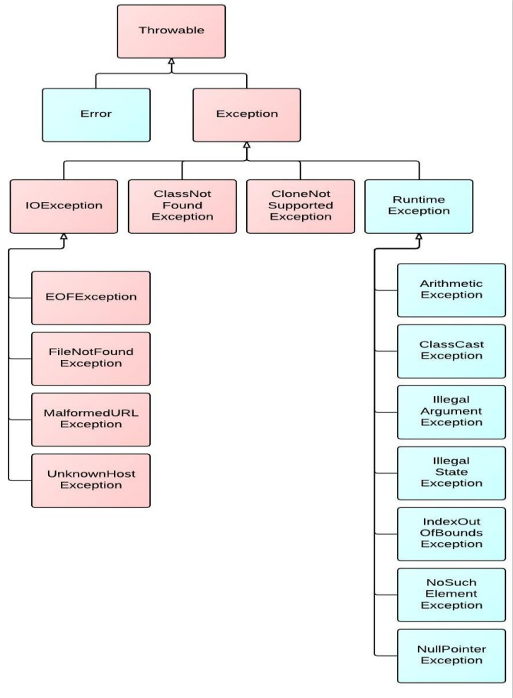
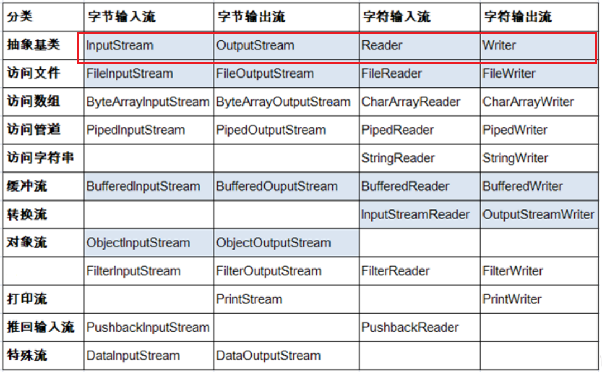

# Java面试题汇总


## 一、Java基础

### 1. String类为什么是final的

```java
public final class String
    implements java.io.Serializable, Comparable<String>, CharSequence {
    /** The value is used for character storage. */
    private final char value[];
```

1. 为了实现字符串池（**只有当字符串是不可变的，字符串池才有可能实现**）
2. 为了线程安全（**一个字符串实例可以被多个线程共享。这样便不用因为线程安全问题而使用同步。字符串自己便是线程安全的。**）

```java
		final char[] chars = new char[]{'S','t','r','i','n','g'};
        chars[0] = 'A';
        
        final int num = 100;
		// 对于final修饰的变量来说，如果是基本数据类型的变量，则其数值一旦在初始化之后便不能更改；
		// 如果是引用类型的变量，是指引用变量不能变，引用变量所指向的对象中的内容还是可以改变的，
		// 也就是说在对其初始化之后便不能再让其指向另一个对象
        //num = 12; //错误的
```

由此可见，String的不可变性并不是由final提供的，而是将chars[]进行私有化，并将String设置成final避免被继承而破坏String的不可变性。

### 2. HashMap的源码，实现原理，底层结构

HashMap底层结构：数组+链表+红黑树

HashMap的扩容机制：当HashMap被初始化创建的时候容量为16，由于初始化的加载因子的值为0.75，所以在集合大小为16*0.75=12的时候开始进行扩容，扩容的大小为当前集合的大小的2倍，也就是32

HashMap的存储机制：当添加key-value时，通过计算key的hash值得到在集合中的索引，如果索引处没有元素，则添加成功。如果有元素，则比较hash值，不相同则添加成功；相同则再比较equals()方法，返回false则添加成功，返回true则用新的value进行替换。

```java
    //基于jdk1.8

    // 默认初始化容量
    static final int DEFAULT_INITIAL_CAPACITY = 1 << 4; // aka 16

    // 默认加载因子
    static final float DEFAULT_LOAD_FACTOR = 0.75f;

	// 树形阈值
    static final int TREEIFY_THRESHOLD = 8;

   	// 最小树化数组容量，当数组长度大于64且链表长度大于8时，链表转为红黑树存储
    static final int MIN_TREEIFY_CAPACITY = 64;
```

```java
//jdk 8 相较于 jdk 7 底层方面的不同：
*      1.new HashMap():底层没有创建一个长度为16的数组；
*      2.jdk 8 底层的数组是：Node[],而非Entry[]
*      3.首次调用put()方法时，底层创建长度为16的数组
*      4.jdk7 底层结构只有：数组+链表。 jdk8 : 数组 + 链表 + 红黑树
*      当数组的某一个索引位置上的元素以链表的形式存在的个数 > 8 且当前数组的长度> 64时，此时此索引位置上的所有数据改为用红黑树存储。

       DEFAULT_INITIAL_CAPACITY : HashMap的默认容量，16;
*      DEFAULT_LOAD_FACTOR：HashMap的默认加载因子 0.75
*      threshold：扩容的临界值，=容量*填充因子 : 16 * 0.75 = 12;
*      TREEIFY_THRESHOLD：Bucket中链表长度大于该默认值，转化为红黑树 8
*      MIN_TREEIFY_CAPACITY：桶中的Node被树化时最小的hash表容量。 64
```

### 3. 说说你知道的几个Java集合类：list、set、queue、map实现类咯。。。

Java中的集合分为value（Conllection），key-value(Map)两种存储结构

> 存储value有分为List 、Set、Queue

List：有序，可存储重复元素

Set：无序，元素不可重复。根据equals和hashcode判断（如果一个对象要存储在Set中，必须重写equals和hashCode方法）

Queue：队列

> 存储key-value的为map







```java
顶层接口有：collection

之后的子接口有List，Queue， Set；

还有一个单独的Map接口

List集合是有序可重复的，支持随即访问，List接口的实现类有LinkedList，ArrayList，Vector

LinkedList底层是双向链表，不支持随即访问，但是插入与删除效率较高，ArrayList支持随机访问，但是插入与删除效率较低

Vector是线程安全的，它在一些关键方法上加了synchronized

Set集合是无序不可重复的，不支持随机访问

Map的存储方式是通过键值对的方式存储值的，键是唯一的，不可重复，value值是可重复的
```

### 4. 描述一下ArrayList和LinkedList各自实现和区别

LinkedList底层是双向链表，不支持随即访问，但是插入与删除效率较高，ArrayList支持随机访问，但是插入与删除效率较低

### 5. Java中的队列都有哪些，有什么区别

Queue： 基本上，一个队列就是一个**先入先出**（FIFO）的数据结构

Queue接口与List、Set同一级别，都是继承了Collection接口。LinkedList实现了Deque接 口。

1. 未实现阻塞接口的：
   **LinkedList** : 实现了Deque接口，受限的队列
      　　**PriorityQueue** ： 优先队列，本质维护一个有序列表。可自然排序亦可传递 comparator构造函数实现自定义排序。
      　　**ConcurrentLinkedQueue**：基于链表 线程安全的队列。增加删除O(1) 查找O(n)
2. 实现阻塞接口的：

　　实现blockqueue接口的五个阻塞队列，其特点：线程阻塞时，不是直接添加或者删除元素，而是等到有空间或者元素时，才进行操作。

　　**ArrayBlockingQueue**： 基于数组的有界队列
　　**LinkedBlockingQueue**： 基于链表的无界队列
　　**ProiporityBlockingQueue**：基于优先次序的无界队列
　　**DelayQueue**：基于时间优先级的队列
　　**SynchronousQueue**：内部没有容器的队列 较特别 --其独有的线程一一配对通信机制

### 6. string、stringbuilder、stringbuffer区别

String：不可变的字符序列;底层使用char[]存储
StringBuffer:可变的字符序列;线程安全的，效率低;底层使用char[]存储
StringBuilder:可变的字符序列;jdk5.0新增的，线程不安全的，效率高;底层使用char[]存储

**对比String、StringBuffer、StringBuilder三者的执行效率**
从高到低排列：StringBuilder > StringBuffer > String

### 7. 反射中，Class.forName和ClassLoader的区别

（1）Class.forName除了将类的.class文件加载到jvm中之外，还会对类进行解释，执行类中的static块。

（2）而classloader只干一件事情，就是将.class文件加载到jvm中，不会执行static中的内容，只有在newInstance才会去执行static块。

**获取Class实例的几种方式**

```java
  		//方式一：调用运行时类的属性：.class
        Class clazz1 = Person.class;
        
        //方式二：通过运行时类的对象,调用getClass()
        Person p1 = new Person();
        Class clazz2 = p1.getClass();

        //方式三：调用Class的静态方法：forName(String classPath)
        Class clazz3 = Class.forName("java.lang.String");

        //方式四：使用类的加载器：ClassLoader （了解）
        ClassLoader classLoader = ReflectionTest.class.getClassLoader();
        Class<?> clazz4 = classLoader.loadClass("java.lang.String");

        System.out.println(clazz1 == clazz4);
```

**类的装载过程**



**类的加载过程**



### 8. 异常的结构，运行时异常和非运行时异常，各举个例子

 * 使用try-catch-finally处理编译时异常，使得程序在编译时就不再报错，但是运行时仍可能报错。相当于我们使用try-catch-finally将一个编译时可能出现的异常，延迟到运行时出现
 * 开发中，由于运行时异常比较常见，所以我们通常不针对运行时异常编写try-catch-finally了。针对于编译时异常，我们说一定要考虑异常的处理

**异常的体系结构**



### 9. String 类的常用方法

**和长度有关的方法**
返回类型      方法名               作用
 int       		 **length()**            得到一个字符串的字符个数（一个中文是一个字符，一个英文是一个字符，一个转义字符是一个字符）

**和数组有关的方法**
返回类型        方法名            	 作用
byte[]        	getBytes()       	 将一个字符串转换成字节数组
char[]        	**toCharArray()**     将一个字符串转换成字符数组
String[]      	split(String)    	将一个字符串按照指定内容劈开

**和判断有关的方法**
返回类型        方法名                         			作用
boolean       **equals(String)**                		 判断两个字符串的内容是否一模一样
boolean       equalsIgnoreCase(String)     忽略大小写的比较两个字符串的内容是否一模一样
boolean       **contains(String)**              		判断一个字符串里面是否包含指定的内容
boolean       startsWith(String)            	   判断一个字符串是否以指定的内容开头
boolean       endsWith(String)              	  判断一个字符串是否以指定的内容结尾

**和改变内容有关的方法**
和改变内容有关的方法，都不会直接操作原本的字符串
而是将符合条件的字符串返回给我们，所以注意接收
返回类型        方法名                         			作用
String        	**toUpperCase()**                 	   将一个字符串全部转换成大写
String        	**toLowerCase()**                 	   将一个字符串全部转换成小写
String       	 replace(String,String)            将某个内容全部替换成指定内容
String     	   replaceAll(String,String)       将某个内容全部替换成指定内容，支持正则
String     	   repalceFirst(String,String)   将第一次出现的某个内容替换成指定的内容
String    	    substring(int)                         从指定下标开始一直截取到字符串的最后
String    	    substring(int,int)                   从下标x截取到下标y-1对应的元素
String   	     **trim()**                                       去除一个字符串的前后空格

**和位置有关的方法**
返回类型        方法名                       	作用
char          	charAt(int)                 	得到指定下标位置对应的字符
int           	  indexOf(String)         	得到指定内容第一次出现的下标
int           	  lastIndexOf(String)   	得到指定内容最后一次出现的下标

### 10. 抽象类和接口的区别

**抽象类和接口的异同**

**相同点**：不能实例化；都可以包含抽象方法的。

**不同点**：把抽象类和接口(Java7,Java8,Java9)的定义、内部结构解释说明

**类**：单继承性    

> ​	接口与接口：多继承

> ​	类与接口：多实现

**JDK7及以前**：只能定义全局常量和抽象方法

> 全局常量：public static final的.但是书写时，可以省略不写

> 抽象方法：public abstract的

**JDK8**：除了定义全局变量和抽象方法之外，还可以定义静态方法、默认方法（略）

**接口通过让类去实现(implements)的方式来使用.**

 * 	  如果实现类覆盖了接口中的所有方法，则此实现类就可以实例化
 * 	  如果实现类没有覆盖接口中的所有方法，则此实现类仍为一个抽象类

**注意点**

- 知识点1：接口中定义的静态方法，只能通过接口来调用。

- 知识点2：通过实现类的对象,可以调用接口中的默认方法。如果实现类重写了接口中的默认方法，调用时，仍然调用的是重写以后的方法

- 知识点3：如果子类(或实现类)继承的父类和实现的接口中声明了同名同参的方法，那么子类在没重写此方法的情况下，默认调用的是父类中的同名同参数的方法。--->类优先原则

- 知识点4：如果实现类实现了多个接口，而这多个接口中定义了同名同参数的默认方法，那么在实现类没有重写此方法的情况下，报错。-->接口冲突。这就需要我们必须在实现类中重写此方法
- 知识点5：如何在子类(或实现类)的方法中调用父类、接口中被重写的方法

### 11. java的基础类型和字节大小

  - byte：1byte = 8bit    (1个字节是8个bit)
  - short：2byte
  - int：4byte
  - long：8byte
  - float：4byte
  - double：8byte
  - boolean：1byte
  - char：2byte

## 二、 Java IO

### 1. 讲讲IO里面的常见类，字节流、字符流、接口、实现类、方法阻塞。

输入流就是从外部文件输入到内存，输出流主要是从内存输出到文件。

IO里面常见的类，第一印象就知道IO流中有很多类，IO流主要分为字节流和字符流。字节流中有抽象类InputStream和OutputStream,他们的子类FileInputStream,FileOutputStream,BufferedOutputStream等字符流BufferedReader和Writer等。都实现了Closeable,Flushable,Appendable这些接口。程序中输入输出都是以流的形式保存的，流中保存的实际上全都是字节文件。

java中阻塞式方法是指在程序调用改方法时，必须等待输入数据可用或者检测到输入结束或者抛出异常，否则程序会一直停留在该语句上，不会执行下面的语句。比如read() 和 readLine()方法。


**流的体系结构**

红框对应的是IO流中的4个抽象基类。蓝框的流需要重点关注



### 2. 讲讲NIO

**对于NIO,它是非阻塞式，核心类：**

1. Buffer为所有的原始类型提供（Buffer）缓存支持

2. Charset字符集编码解决方案

3. Channel一个新的原始I/O抽象，用于读写Buffer类型，通道可以认为是一种连接，可以是到特定设备，程序或者是网络的连接。

### 3. 字节流和字符流的区别？

字符流和字节流的使用非常相似，但是实际上字节流的操作不会经过缓冲区（内存）而是直接操作文本本身的。而字符流的操作会先经过缓冲区（内存）然后通过缓冲区再操作文件

以字节为单位输入输出数据，字节流按照8位传输。

以字符为单位输入输出数据，字符流按照16位传输。

### 4. 什么是Java序列化，如何实现Java序列化？

序列化就是一种用来处理对象流的机制，将对象的内容进行流化。可以对流化后的对象进行读写操作，可以将流化后的对象传输于网络之间。序列化是为了解决在对象流读写操作时所引发的问题。

序列化的实现：将需要被序列化的类实现Serialize接口，没有需要实现的方法，此接口只是为了标注对象可被序列化的，然后使用一个输出流（如：FileOutputStream）来构造一个ObjectOutputStream(对象流)对象。再使用ObjectOutputStream对象的write(Object obj)方法就可以将参数obj的对象写出。

### 5. 什么是节点流，什么是处理流，各有什么好处，处理流的创建有什么特征？

节点流：直接与数据源相连接，用于输入或者输出

处理流：在节点流的基础上对之进行加工，进行一些功能的扩展

处理流的构造器必须要传入节点流的子类

### 6. 什么是IO流？

它是一种数据的流从源头流到目的地。比如文件拷贝，输入流和输出流都包括了。输入流从文件中读取数据存储到进程（process）中，输出流从进程中读取数据然后写入到目标文件。

### 7. 什么是缓冲区？有什么作用？

缓冲区就是一段特殊的内存区域，很多情况下当程序需要频繁地操作一个资源（如文件或数据库）则性能会很低，所以为了提升性能就可以将一部分数据暂时读写到缓存区，以后直接从此区域中读写数据即可，这样就显著提升了性能。

对于java字符流的操作都是在缓存区操作的，所以如果我们想在字符流操作中主动将缓冲区刷新到文件则可以使用flush()方法操作。

### 8. 什么是BIO？什么是NIO?

IO操作包括：对硬盘的读写、对socket的读写一级外设的读写。

当用户线程发起一个IO请求操作（本文以读请求操作为例），内核会去查看读取的数据是否就绪，对阻塞IO来说，如果数据没有就绪，则会一直等待，直到数据就绪；对于非阻塞IO来说，如果数据没有就绪，则会返回一个标志信息告知用户线程当前要读的数据没有就绪。当数据就绪之后，便将数据拷贝到所有用户线程，这样才完成一个完整的IO读请求操作，也就是说一个完整的IO读请求操作包括两个阶段:

查看数据是否就绪；

进行数据拷贝（内核将数据拷贝到用户线程）

那么阻塞（blocking IO） 和 非阻塞（non-blocking IO）的区别就在于第一阶段，如果数据没有就绪，在查看数据是否就绪的过程中是一直等待，还是直接返回一个标志信息，

Java中传统的IO都是阻塞IO,比如通过socket来读数据,调用read()方法之后，如果数据没有就绪，当前线程就会一直阻塞在read方法调用哪里，直到有数据才返回；而如果是非阻塞IO的话，当数据没有就绪，read()方法应该返回一个标志信息，告知当前线程数据没有就绪，而不是一直在那里等。

### 9. String 编码UTF-8 和GBK的区别

**GBK**：中国的中文编码表升级，融合了更多的中文文字符号。最多两个字节编码 

**UTF-8**：变长的编码方式，可用1-4个字节来表示一个字符。

### 10. BIO和NIO和AIO的区别以及应用场景

同步：java自己去处理io

异步：java将io交给操作系统去处理，告诉缓存区大小，处理完成回调。

阻塞：使用阻塞IO时，Java调用会一直阻塞到读写完成才返回。

非阻塞：使用非阻塞IO时，如果不能立马读写，Java调用会马上返回，当IO时间分发器通知可读写时正在进行读写，不断循环直到读写完成。

BIO: 同步并阻塞，服务器的实现模式是一个连接一个线程，这样的模式很明显一个缺陷：由于客户端连接数与服务器线程数成正比，可能造成不必要的线程开销，严重的还将导致服务器内存溢出。当然，这种情况可以通过线程池机制改善，但并不能从本质上消除这个弊端。

NIO:在JDK1.4以前，Java的IO模型一直是BIO,但从JDK1.4开始，JDK引入的心的IO模型NIO,它是同步非阻塞的。而服务器的实现模式是多个请求一个线程，即请求会注册到多路复用器Selector上，多路复用器轮询到连接有IO请求时才启动一个线程处理。

AIO:JDK1.7发布了NIO2.0，这是真正意义上的异步非阻塞，服务器的实现模式为多个有效请求一个线程，客户端的IO请求都是由OS先完成再通知服务器应用去启动线程处理（回调）。

应用场景：并发连接数不多时采用BIO，因为它编程和调试都非常简单，但如果涉及到高并发的情况，应选择NIO或AIO，更好的建议是采用成熟的网络通信框架 Netty

## 三、Java Web

### 1. session和cookie的区别和联系，session的生命周期，多个服务部署时session管理


**对于cookie：**

1. cookie是创建于服务器端

2. cookie保存在浏览器端

3. cookie的生命周期可以通过cookie.setMaxAge(2000);来设置，如果没有设置setMaxAge,则cookie的生命周期当浏览器关闭的时候，就消亡了

4. cookie可以被多个同类型的浏览器共享  可以把cookie想象成一张表

**比较：**

1. **存在的位置：**

- cookie 存在于客户端，临时文件夹中

- session：存在于服务器的内存中，一个session域对象为一个用户浏览器服务

2. **安全性**

- cookie是以明文的方式存放在客户端的，安全性低，可以通过一个加密算法进行加密后存放

- session存放于服务器的内存中，所以安全性好

3. **网络传输量**

- cookie会传递消息给服务器

- session本身存放于服务器，不会有传送流量

4. **生命周期(以20分钟为例)**

- cookie的生命周期是累计的，从创建时，就开始计时，20分钟后，cookie生命周期结束，

- session的生命周期是间隔的，从创建时，开始计时如在20分钟，没有访问session，那么session生命周期被销毁但是，如果在20分钟内（如在第19分钟时）访问过session，那么，将重新计算session的生命周期

- 关机会造成session生命周期的结束，但是对cookie没有影响
- 访问范围
  - session为一个用户浏览器独享
  - cookie为多个用户浏览器共享

**使session失效的方法：**

1. 关闭tomcat

2. reload web应用

3. session时间到

4. invalidate  session

## 四、开源框架

### 1. hibernate和ibatis的区别

- ibatis非常简单易学，Hibernate相对较复杂，门槛较高。iBATIS拿来文档看半天到两天就可以掌握了。Hibernate可能需要3倍以上的时间来掌握。

- 二者都是比较优秀的开源产品。但Hibernate现在已经是主流O/R Mapping框架，从文档的丰富性，产品的完善性，版本的开发速度都要强于iBATIS。

- 当系统属于二次开发，无法对数据库结构做到控制和修改，那iBATIS的灵活性将比Hibernate更适合。

- 系统数据处理量巨大，性能要求极为苛刻，这往往意味着我们必须通过经过高度优化的SQL语句（或存储过程）才能达到系统性能设计指标。在这种情况下iBATIS会有更好的可控性和表现。iBatis比Hibernate更容易进行sql的优化。鉴于一般系统性能的瓶颈都在数据库上，所以这一点是iBatis非常重要的一个优势。

- iBatis 可以进行细粒度的优化

### 2. 讲讲mybatis的连接池

